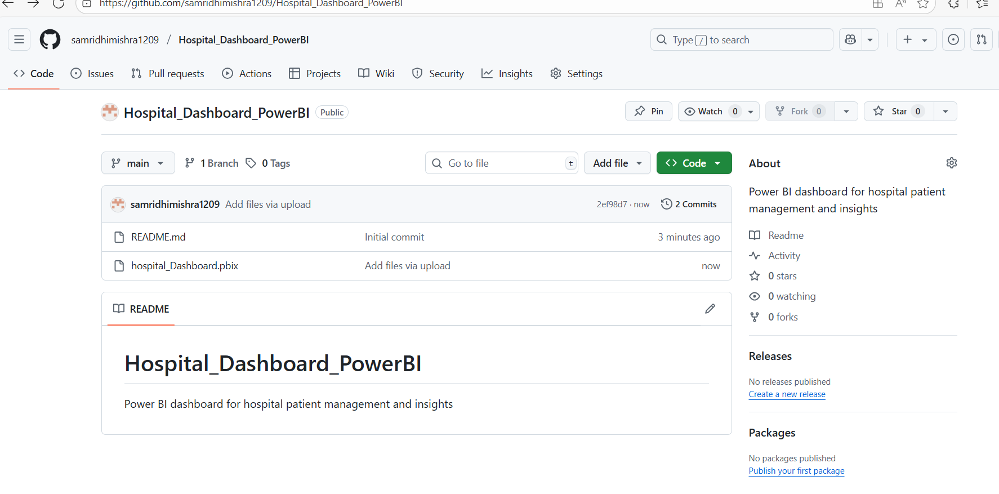

# Hospital_Dashboard_PowerBI

# 🏥 Hospital Dashboard – Power BI

A Power BI dashboard for hospital patient management and insights, designed to help healthcare professionals monitor key metrics, improve efficiency, and make data-driven decisions.

---

## 📊 Features
- **Patient Management:** Track patient admissions, discharges, and current occupancy.
- **Department Insights:** View performance metrics for different hospital departments.
- **Treatment Analysis:** Monitor treatment outcomes and patient recovery trends.
- **Resource Utilization:** Analyze bed occupancy rates and staff allocation.
- **Time Trends:** Identify peak patient load times for better planning.

---

## 📷 Dashboard Preview


---

## 🛠️ Tools & Technologies
- **Power BI**
- **Data Modeling**
- **DAX Calculations**
- **Data Visualization**

---

## 📂 How to Use
1. Clone this repository:
   ```bash
   git clone https://github.com/your-username/Hospital_Dashboard_PowerBI.git
